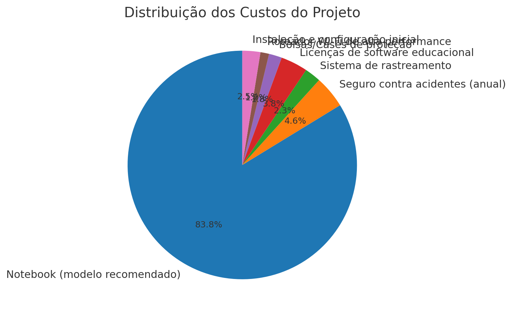
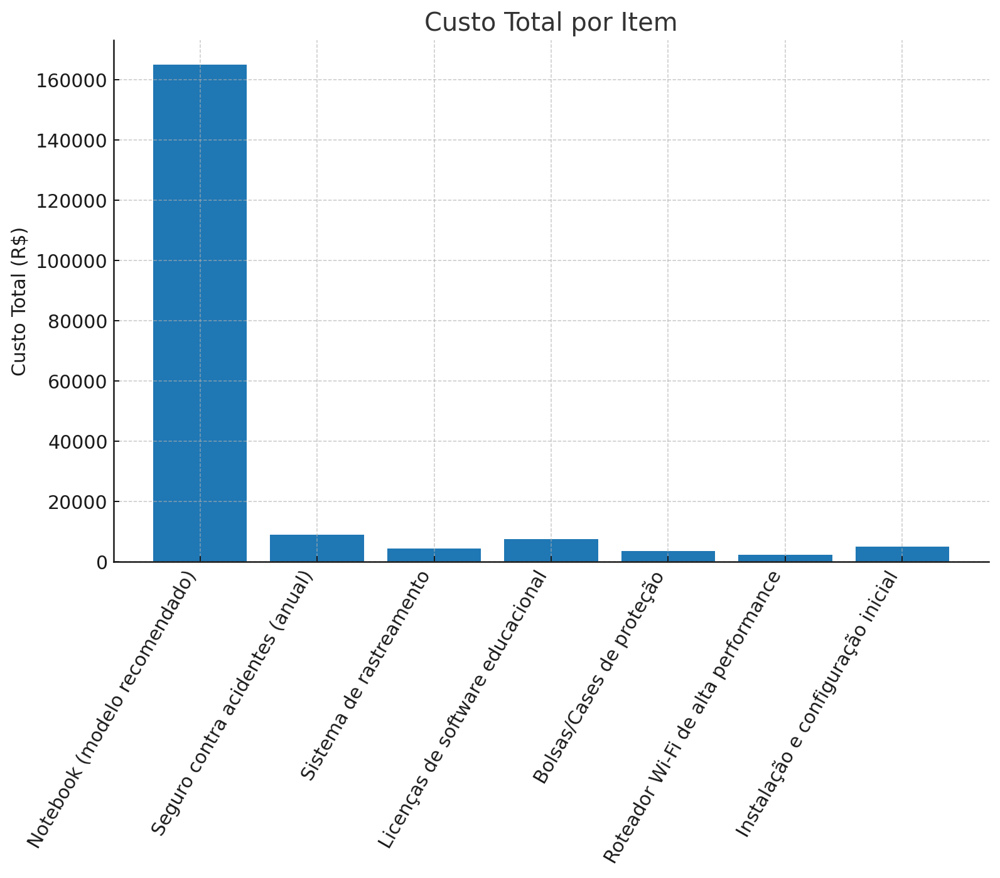

# Projeto de Modernização Tecnológica: Aquisição de Notebooks — Escola Futuro Digital

> **Status**: Proposta técnica para apreciação da direção e setor de compras.  
> **Versão**: 1.1 (com análises e gráficos gerados por Python)

## 1. Resumo Executivo
Substituição de computadores fixos e obsoletos por **30 notebooks modernos**, ampliando mobilidade, flexibilidade e eficiência pedagógica. Espera-se melhoria do engajamento em sala, aulas em múltiplos ambientes, otimização do consumo energético e modernização da infraestrutura.

## 2. Introdução e Justificativa
A infraestrutura atual sofre com lentidão, alto consumo de energia e limitação a laboratórios fixos. A adoção de notebooks permite levar tecnologia **para qualquer sala**, biblioteca ou campo, favorecendo metodologias ativas, colaboração e inclusão digital. Além disso, notebooks oferecem **menor TCO** ao longo do tempo (eficiência energética, menor espaço físico, upgrades modulares) e implantação mais ágil que desktops tradicionais.

## 3. Objetivos
- Promover **mobilidade e flexibilidade** no uso dos recursos computacionais.  
- Reduzir **consumo de energia** (~25% vs. desktops equivalentes).  
- Aumentar em **40%** a utilização dos equipamentos em diferentes ambientes.  
- Melhorar tempos de inicialização e atualização de software.  
- Proteger o investimento com **seguro** e **rastreamento**.

## 4. Especificações Técnicas (mínimo vs. recomendado)
| Componente | Mínimo | Recomendado |
| :-- | :-- | :-- |
| Processador | Intel Core i5 11ª Geração / Ryzen 5 | Intel Core i7 12ª Geração / Ryzen 7 |
| Memória RAM | 8 GB DDR4 | 16 GB DDR4 |
| Armazenamento | SSD 256 GB NVMe | SSD 512 GB NVMe |
| Tela | 14” Full HD | 15.6” Full HD IPS |
| Bateria | 6 h | 9 h |
| Peso | até 2,0 kg | até 1,6 kg |
| Conectividade | Wi‑Fi 6, Bluetooth 5.0 | Wi‑Fi 6, Bluetooth 5.2 |
| Portas | 2×USB‑A, 1×USB‑C, HDMI | 3×USB‑A, 2×USB‑C, HDMI |

**Imagem ilustrativa**  
  
*Figura 1 — Distribuição percentual dos custos do projeto.*

**Links de referência (exemplos):**  
- Especificações ThinkPad T14s (exemplo de perfil corporativo).  
- Benefícios de mobilidade na educação (ex.: Intel Education).  
- Vídeos de referência fornecidos na atividade:  
  - https://www.youtube.com/watch?v=myQuetgSEsY  
  - https://www.youtube.com/watch?v=D-qlLy5DNZA  
  - https://www.youtube.com/watch?v=mu-SRK3sKik  

## 5. Orçamento Estimado
Arquivo em **Excel** com detalhes: [`orcamento_notebooks.xlsx`](orcamento_notebooks.xlsx)

| Item | Quantidade | Custo Unitário (R$) | Custo Total (R$) | % do Total |
|---|---:|---:|---:|---:|
| Notebook (modelo recomendado) | 30 | 5,500.00 | 165,000.00 | 83.8% |
| Seguro contra acidentes (anual) | 30 | 300.00 | 9,000.00 | 4.6% |
| Sistema de rastreamento | 30 | 150.00 | 4,500.00 | 2.3% |
| Licenças de software educacional | 30 | 250.00 | 7,500.00 | 3.8% |
| Bolsas/Cases de proteção | 30 | 120.00 | 3,600.00 | 1.8% |
| Roteador Wi‑Fi de alta performance | 2 | 1,200.00 | 2,400.00 | 1.2% |
| Instalação e configuração inicial | 1 | 5,000.00 | 5,000.00 | 2.5% |

**TOTAL GERAL ESTIMADO:** **R$ 197,000.00**

### Indicadores de Custo
- **TCO inicial por notebook (estimado):** R$ 6,566.67  
- **Custo por item (visual):**  
  

## 6. Benefícios Esperados
- **Flexibilidade:** uso em sala, laboratório, biblioteca e campo.  
- **Modernização:** dispositivos atuais e com melhor compatibilidade de software.  
- **Eficiência energética:** menor consumo que desktops equivalentes.  
- **Manutenção simplificada:** menos peças móveis e upgrades focados em SSD/RAM.  
- **Segurança do investimento:** seguro e rastreamento como políticas padrão.

## 7. Comparativo Notebook × Desktop
| Critério | Desktop | Notebook |
| :-- | :-- | :-- |
| Mobilidade | Baixa | Alta |
| Consumo energético | Alto | Baixo |
| Espaço físico | Alto | Baixo |
| Implantação | Lenta | Rápida |
| Custo total ao longo do tempo | Maior | Menor |
| Uso interdisciplinar | Limitado ao laboratório | Em qualquer ambiente |

## 8. Plano de Manutenção e Suporte
- Política de atualização trimestral de SO e drivers.  
- Higienização preventiva semestral.  
- Inventário com etiquetas e **rastreamento** ativo.  
- Garantia mínima de 12 meses + **seguro por danos acidentais**.  
- Abertura de chamados via helpdesk (SLA: 48h).

## 9. Análise de Riscos
| Risco | Probabilidade | Impacto | Mitigação |
| :-- | :--: | :--: | :-- |
| Atraso na entrega | Média | Médio | Pedido antecipado, cláusulas contratuais |
| Aumento de preço | Média | Médio | Múltiplos fornecedores e cotação |
| Falhas de hardware | Baixa | Alto | Garantia + seguro |
| Extravio/roubo | Baixa | Alto | Rastreamento e políticas de uso |

## 10. Cronograma (Simplificado)
| Fase | Período |
| :-- | :-- |
| Planejamento e aprovação | 1ª quinzena de setembro |
| Aquisição | 2ª quinzena de setembro |
| Instalação e configuração | 1ª semana de outubro |
| Implantação e treinamento | 2ª semana de outubro |

## 11. Automação de Buscas e Links de Compra
Use `busca_links.py` para obter **links confiáveis** automaticamente via **Google Custom Search API** com filtros por domínio.  
Edite a variável `CSE_ID` e a chave `GOOGLE_API_KEY` como variáveis de ambiente.

```bash
export GOOGLE_API_KEY="SUA_CHAVE"
export CSE_ID="SEU_CSE_ID"
python busca_links.py "Notebook i7 16GB 512GB site:amazon.com.br"
```

## 12. Arquivos Gerados
- `RELATORIO.md` — resumo executivo das análises e indicadores.  
- `orcamento_notebooks.xlsx` e `orcamento_notebooks.csv` — orçamento estruturado.  
- `custo_distribuicao_pizza.png` e `custo_barras.png` — gráficos.  
- `busca_links.py` — script para busca automatizada de links.

---

> **Observação:** Os valores são estimativas para fins acadêmicos e podem variar conforme fornecedores e datas de cotação.
